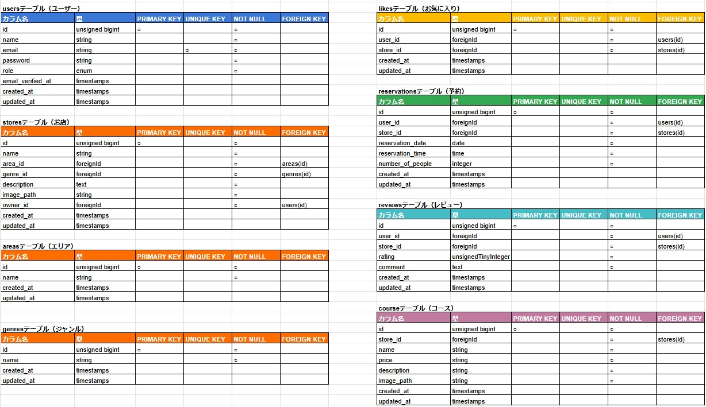

# Rese（リーズ）
- 飲食店予約サービス管理アプリ
- トップ画面の画像


## 作成した目的
外部の飲食店予約サービスは手数料を取られるので自社で予約サービスを持ちたいため。

## アプリケーションURL
- トップ画面：https://rese0717.com/
- 新規登録画面：https://rese0717.com/register
- 一般ユーザーログイン：https://rese0717.com/login
- 店舗代表者ログイン：https://rese0717.com/owner/login
- 管理者ログイン：https://rese0717.com/admin/login
- phpMyAdmin：http://<EC2のパブリックIP>:8080

※phpMyAdmin の URL では、<EC2のパブリックIP> を実際の IP アドレスに置き換えて記載してください。<br>
※ログインの際は下記テストアカウントを使用してください。

## テストアカウント
- name: 一般ユーザー1  
  - email: user1@gmail.com  
  - password: password  

- name: 仙人店舗代表者  
  - email: owner1@gmail.com  
  - password: password  

- name: 管理者  
  - email: admin@gmail.com  
  - password: password

## 機能一覧
- 会員登録
- ログイン
- ユーザー情報取得
- ユーザー飲食店お気に入り一覧取得
- ユーザー飲食店予約情報取得
- 飲食店一覧取得
- 飲食店詳細取得
- 飲食店お気に入り追加
- 飲食店お気に入り削除
- 飲食店予約情報追加
- 飲食店予約情報削除
- エリアで検索する
- ジャンルで検索する
- 店名で検索する

## 使用技術
- **バックエンド**：Laravel 8.83.29 (PHP 7.4.9)
- **フロントエンド**：Blade / Tailwind CSS
- **インフラ**：
  - AWS EC2（Ubuntu 24.04 LTS）
  - RDS（MySQL 8.0.40）
  - S3（画像保存）
  - Let's Encrypt（SSL化）
- **コンテナ管理**：Docker / docker-compose
- **Webサーバー**：Nginx
- **認証機能**：Laravel Fortify
- **その他ツール**：
  - VSCode（EC2リモート開発）
  - Git / GitHub

## テーブル設計


## ER図


## セットアップ手順（開発環境）
```
git clone git@github.com:kttmm717/restaurant-reservation-production.git
cd restaurant-reservation-production
cd src
cp .env.example .env
cd ../
docker-compose up -d --build
docker-compose exec php bash
composer install
php artisan key:generate
php artisan migrate --seed
npm install && npm run dev
php artisan serve
```
.env.exampleを.envにコピー後、以下を環境に合わせて入力してください
- DB情報
- AWS情報
- MAIL情報
- Stripe APIキー

## メール認証
mailtrapというツールを使用しています。<br>
以下のリンクから会員登録をしてください。　<br>
https://mailtrap.io/

メールボックスのIntegrationsから 「laravel 7.x and 8.x」を選択し、　<br>
.envファイルのMAIL_MAILERからMAIL_ENCRYPTIONまでの項目をコピー＆ペーストしてください。　<br>
MAIL_FROM_ADDRESSは任意のメールアドレスを入力してください。

## その他
- 各ページの左上の青文字RESEのロゴをクリックすると、各ページに飛べるHOME画面に遷移します。
- 評価機能について、予約日の翌日以降から、利用者が店舗を５段階評価とコメントのレビューができるようになります。
- 予約削除機能について、マイページの各予約（青背景）の右上バツをクリックすると予約削除ができます。